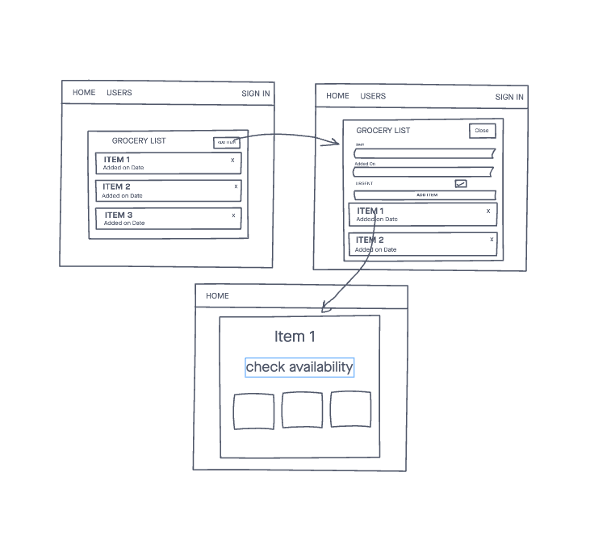
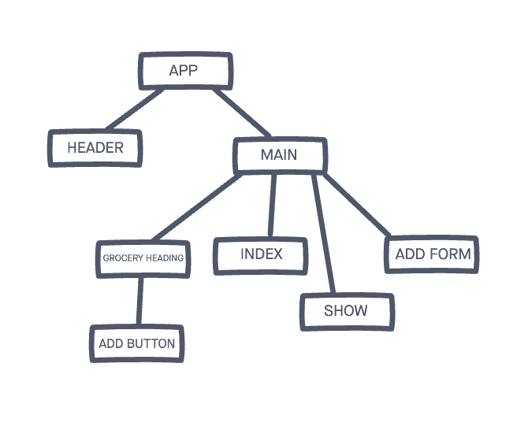
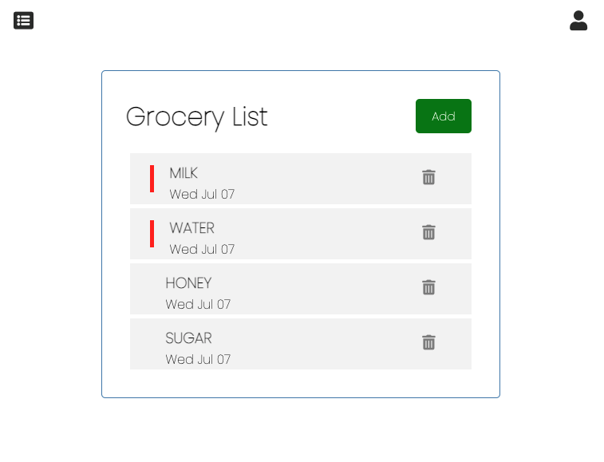
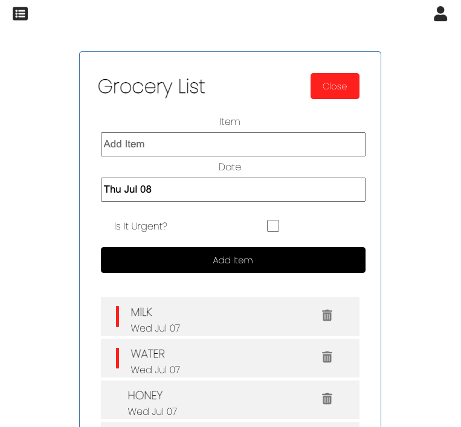

# Grocery List

A simple grocery list that lets you add and delete grocery items and also helps you check the availability of the item in your nearest grocery store.

## Technologies Used

-   HTML5
-   SASS
-   JAVASCRIPT
-   MONGODB
-   EXPRESS
-   REACT
-   NODE

## Website used to Deploy

-   Backend - Heroku
-   Frontend - Netlify

## Wireframe

## Flowchart

## Future Enhancements

-   Authentication

## Website Link

### [Trello Board](https://trello.com/b/7WUcP6WF/grocery-list)

### [Backend](https://backend-grocerylist.herokuapp.com/grocery)

### [Grocery List App](https://mystifying-kilby-d16d5d.netlify.app/)

## Screenshots

